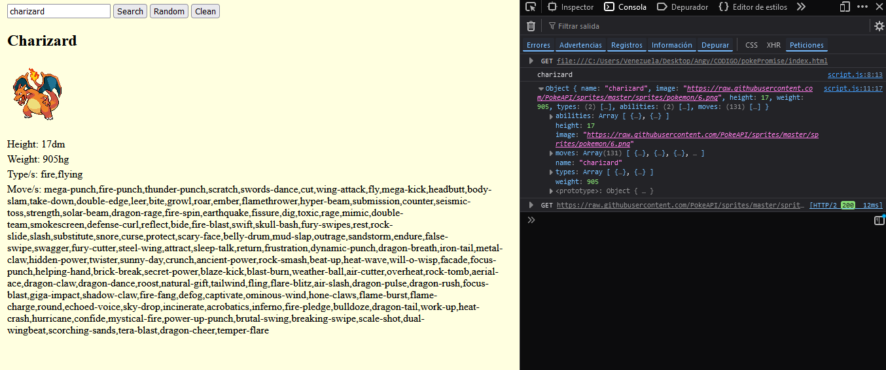
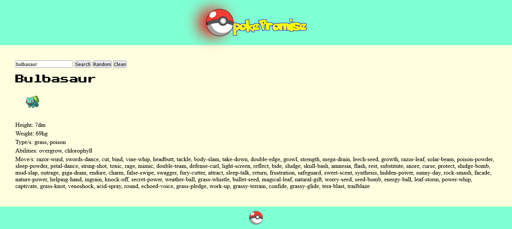

# pokePromise

I messed up real good in a technical test so I knew I had to go over some things.

## Layout versions
- ### Version 1 - 24/11 
    
- ### Version 2 - 26/11
    

## What's pokePromise?

PokePromise is a simple web application that uses the [PokéAPI](https://pokeapi.co/docs/v2) to fetch Pokémon data. The project allows users to search for Pokémon by their name or ID, and it displays relevant information about the selected Pokémon, such as its image, height, weight, types, and moves.

This is an incomplete project and currently provides functionality for searching Pokémon. Additional features are planned for the future.

## Features

- Search Pokémon: Enter a Pokémon's name or ID in the input field and click the "Search" button to fetch and display details about the Pokémon.
- Dynamic Results: Results include Pokémon name, image, height, weight, types, and moves.
- Responsive UI: Styled with basic CSS for simplicity.

## Future Features

- Random Button: Fetch and display information for four random Pokémon on the screen.
- Clean Button: Clear all results displayed in the results section.

## Current Implementation

The Search button is fully functional and uses the `getPokemon()` function to retrieve data from the PokéAPI.
The search results are dynamically inserted into the DOM using JavaScript.

## Requirements

A modern web browser to run the application.
Internet connection to fetch data from the PokéAPI.

## Usage

- Clone or download this repository.
- Open the index.html file in your preferred web browser.
- Type a Pokémon name or ID in the search field and click the Search button.

## Known Issues

The "Random" button is currently non-functional. These features will be implemented in future updates.
Error handling for invalid inputs could be improved.

## To-Do List

- [] Implement the Random Button to fetch and display four random Pokémon.
- [x] Implement the Clean Button to clear the results section.
- [] Enhance error handling for invalid Pokémon names or IDs.
- [] Add animations or additional styling to improve the user interface.

## How to Contribute

Feel free to fork this repository, implement the missing features, or make improvements. Pull requests are welcome!